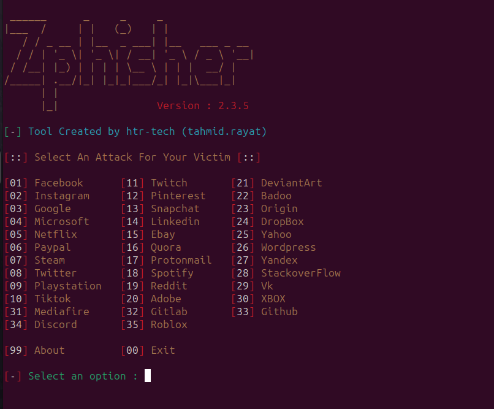
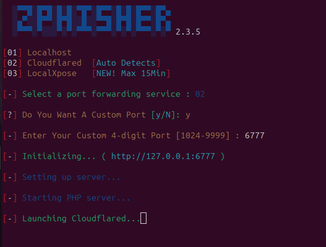
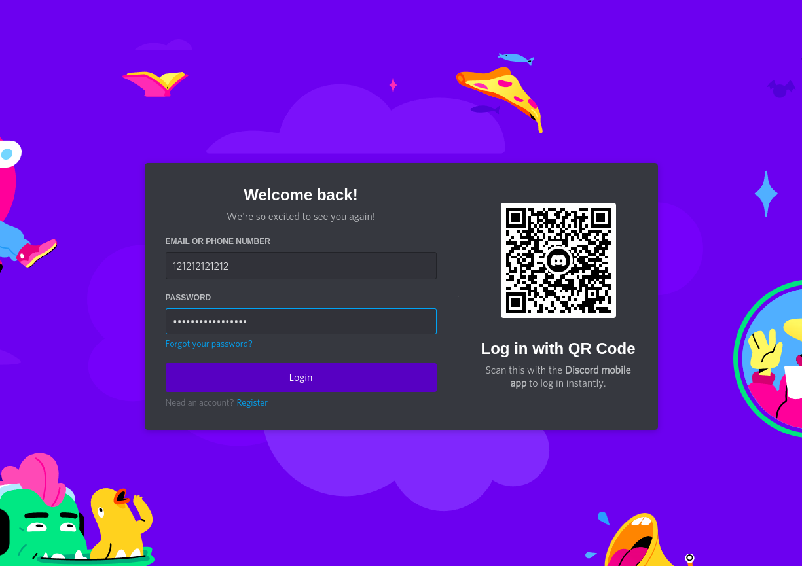
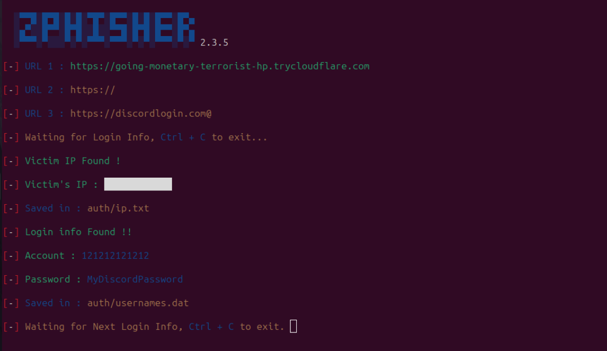

# **Phishing Project**

## **Task One**

ScreenShot of [Phishing Quiz](https://phishingquiz.withgoogle.com/)

[]

## **Task Two**

**Research Phishing comprehensively. Explore its various types, including spear phishing, vishing, smishing, and pharming. Look into how these types differ, their common techniques, and real-life examples. Additionally, investigate the psychological tactics used in phishing attacks to manipulate victims.**

### **Phishing:**

is used to lure individuals into providing sensitive data such as personally identifiable information, banking and credit card details, and passwords by disguising as a trust worthy source by various means as given bellow.

### **Types of Phishing:**

**1. Spear Phishing**:

are highly personalized Phishing attacks which was made for a specific organization or individual. Spear-phishing attacks are more likely to deceive potential victims due to the amount of research and time spent personalizing messages that appear to be from legitimate senders. 

**Case:**:

Google and Facebook fell victim to a fake invoice scam that amounted to losses of over **£75.5 million**. Hacker **Evaldas Rimasauskas**, aged 50, and unnamed collaborators essentially posed as a Taiwan-based hardware company. Their elaborate fraud first involved setting up a company in Latvia impersonating the hardware company. The group then sent fake invoices, contracts, letters and such to the tech companies, falsely billing them for millions of dollars over a period of years. He was eventually convicted of wire fraud, but both organizations were able to recover only half of the stolen money.
[Click for more details](https://betanews.com/2023/06/29/worlds-most-expensive-phishing-attacks-2/#:~:text=In%202016%2C%20Crelan%20Bank%20lost,the%20sender%20as%20the%20CEO.)

**Prevention**:

    - Implement Anti-Phishing, but spear-phishing emails usually contain no malware and are almost never spam, which is why they often easily bypass traditional security mechanisms

    - Hence also check for domain spoofing, any instances of impersonation, and flagging questionable content in the email.

    - Multi-Factor Authentication : sensitive data can only be accessed upon the comletion of an authentication process which has two or more steps

**2. Clone Phishing**:

 is when the attacker duplicates an email that someone has previously received. By substituting malware for the email’s real attachments or substituting a malicious link

**Prevention**:

    - Deja Vu:If a recipient gets two copies of the same email, then it’s possible that one of them is an attempted clone phishing attack

    - If a domain has DMARC enabled, then a clone phishing email should fail DMARC authentication

::: warning
[DMARC](https://dmarc.org/) , which stands for “Domain-based Message Authentication, Reporting & Conformance”, is an email authentication, policy, and reporting protocol. It builds on the widely deployed SPF and DKIM protocols, adding linkage to the author (“From:”) domain name, published policies for recipient handling of authentication failures, and reporting from receivers to senders, to improve and monitor protection of the domain from fraudulent email.
:::

**3. Vishing**:

uses raudulent phone calls or voice messages designed to trick victims into providing sensitive information, which can then be used for criminal activities such as fraud, identity theft, or financial theft.

**Cases:**:

Latest:A caller used an online voice modulator to pose as the brother of an IT professional with a software company in Magarpatta City and mislead her into transferring Rs6.7 lakh to treat her ailing mother,
[Click for more details](https://timesofindia.indiatimes.com/city/pune/it-professional-loses-rs6-7-lakh-to-caller-posing-as-bro-with-voice-modulator/articleshow/106414033.cms)

In India,
In the year 2018, nearly 30% of calls were reported as spam and vishing.
Almost 43% of breaches involve small-scale businesses and industries.
Vishing attacks resulted in a loss of around $450 million since 2014.

**Prevention**:

    - Aggressive call tactics: Vishing and phishing tactics typically incite urgency or fear. You might hear phrases like urgent account problem, suspicious activity detected, or final warning to prompt hasty reactions.

    - Sensitive data requests: such as passwords, PINs, verification codes, or financial information. Legitimate institutions will never request such details through unsolicited calls.

    - publicly available information: might present what seems like personal knowledge about you, harvested from online sources or social media, to make the call seem legitimate.

    - if fallen victim:Alert your financial institutions,Change all compromised passwords, PINs, and security credentials,Notify the relevant company or institution that the scammer claimed to represent

**5. Smishing**:

is a type of attack that uses fake mobile text messages to trick people into downloading malware, sharing sensitive information or sending money to cybercriminals

**Cases:**:

at the height of the COVID-19 pandemic, the Federal Trade Commission (FTC) warned of smishing attacks that offered tax relief, free COVID tests and similar services.

May 2018, Cincinnati, Ohio-based financial institution Fifth Third Bank's customers were receiving text messages on their phones which contained a link to unlock their accounts and led customers to a Web site that mimicked the legitimate Fifth Third site, then used the phished data to withdraw $68,000 from 17 ATMs in Illinois, Michigan, and Ohio in less than two weeks using Fifth Third’s cardless ATM function.
[Click for more details](https://www.biometricupdate.com/201805/cardless-atm-creating-a-secure-and-convenient-customer-experience)

**Prevention**:

    - Avoid using links or contact info in messages that make you uncomfortable. Go directly to official contact channels when you can.

    -  Never give passwords and text message two-factor authentication (2FA) recovery codes to anyone, and only use it on official sites.

    - approach urgent account updates and limited time offers as caution signs of possible smishing

**6. Quishing**:

Instead of a text-based link, the malicious website is pointed to by a QR code which makes it far more difficult to detect and block, Identifying QR codes in emails and extracting the URLs is much more difficult than simply reading a link from the message text.

**Case:**:

In Bengaluru alone, there were approximately 21,000 reported cases between 2017 and May 2023, accounting for 41% of incidents related to QR codes, malicious links, or debit/credit card fraud. 

A 30-year-old professor selling his washing machine online was scammed via QR code. The buyer offered the asking price, then sent a QR code for "quick payment" that stole Rs 63,000.
[Click for more details](https://www.indiatoday.in/technology/features/story/qr-code-scam-cases-rising-in-india-what-is-happening-how-to-stay-safefeature-2426017-2023-08-24)

**Prevention**:

    - Don’t scan QR codes originating from an unknown or untrusted source.

    - Email scanners may be able to identify quishing emails based on text content, the QR codes themselves, or other phishing red flags.

**7. Pharming**:

Pharming is a sophisticated type of fraudulent activity that redirects internet users to fake websites by 
1. Malware infection:These can infect a user’s computer or network, alter DNS settings, or manipulate the host’s file to redirected to a malicious site without their knowledge when they try to access a legitimate website.

2. DNS cache poisoning:By poisoning the DNS cache, attackers can manipulate the mapping between domain names and IP addresses.

3. Rogue DNS servers: Attackers can set up rogue DNS servers or compromise existing ones. When users attempt to visit a legitimate website, their requests are redirected to these malicious DNS servers. The servers then provide fake IP addresses, leading users to fraudulent websites.

**Case:**:

An attack this week that targeted online customers of at least 50 financial institutions in the U.S., Europe and Asia-Pacific region has been shut down. If a user with an infected PC then visited any of the targeted banking sites, he was redirected to a mock-up of the bank's Web site that collected his login credentials and transferred them to the Russian server, Gonzalez said. The user was then passed back to the legitimate site where he was already logged in, making the attack invisible.
The controller also shows infection statistics. Websense said at least 1,000 machines were being infected per day, mostly in the U.S. and Australia.
[CLick for more details](https://www.computerworld.com/article/2543237/elaborate--pharming--attack-targeted-50-banks.html)

**Prevention**:

    - Deploy a reputable anti-virus solution

    - Reputable and trustworthy internet service providers (ISPs) automatically filter bogus pharming redirects, which prevents users from ever visiting pharming websites.

    - Other attackers will use website URL shorteners, such as Bitly, to hide the fact that their website is spoofed. It is therefore crucial to never click a shortened web link in an email or other direct message, and generally avoid clicking links from unknown sources.

**8. Image-based Phishing**:

Image-based phishing is used to prevent anti-spam and email security scanners from analyzing an email’s text.To make things even harder, images are not embedded into an email, but rather hosted remotely, typically on a reputable domain, such as Wikipedia, GitHub or Google. This gives hackers a couple of advantages. First, the user sees an image in the email, but the filter only sees the link.

**Prevention**:

    - Disabling automatic image display would force users to click to view images, allowing for a quick security check before clicking.

    - Checking links on mobile might be trickier, but you can usually press and hold the link to see the URL in a pop-up. Avoid accidentally tapping the link in the process.

**Psychological Tactics**

    1. Stress: 
    
    You may be experiencing a stressful day at the office and that can lead to wanting to clear your inbox as fast as possible - the result? You may not have read each email carefully and clicked on something in order to cross it off your 'to do' list.

    2. Over confidence: 
    
    Regardless if you've done the training and know what to look out for. Humans tend to be overly confident in their ability to avoid scams but if someone is targeting your amygdala - you may still be susceptible.

    3. Fear and Urgency:

    Phishers often use fear-inducing tactics to manipulate their targets. They create a sense of urgency, making victims believe they need to act immediately to avoid dire consequences. This triggers the fight-or-flight response, impairing rational decision-making. For example, a scam email might threaten account suspension or legal action, compelling the victim to act impulsively.

    4. Trust and Authority:

    Humans have a natural tendency to trust authority figures. Phishers exploit this by posing as trusted institutions, like banks or government agencies. When individuals receive an email seemingly from a reputable source, they are more likely to comply with requests for sensitive information.

    5. Curiosity and Greed:

    Some phishing scams rely on human curiosity and greed. They promise enticing offers, exclusive deals, or appealing content, which prompt individuals to click on malicious links or download infected files without second thoughts.

    6. Social Engineering:

    Phishers often use social engineering techniques to exploit the innate desire for social connection. This can involve impersonating friends or colleagues, prompting individuals to share confidential information or click on malicious links without suspicion.

## **Task Three**

**Delve into the consequences of phishing attacks for victims and organizations. Explore the financial, reputational, and legal impacts, as well as any long-term consequences such as identity theft or data breaches.**

### Impact of Phishing

**1. Financial Loss**

The costs of providing identity protection and/or reimbursement to employees or customers who have their data stolen, as well as theft from your company itself, can easily run into the millions. For example, should regulatory bodies choose to issue maximum penalties following a breach, as in the case of the data protection act following the misuse of data at Facebook, fines could be astronomical.
[cost of data breach](https://www.packetlabs.net/posts/pandemic-cost-of-data-breach/)

**2. Reputational Damage**

the public disclosure of a humiliating internal communications breach can create reputational damage that taints the brand indefinitely. The media exposure alone around a serious breach sways the perception of the overall brand as untrustworthy for employees, partners, and customers.
Eg:  **Coca Cola’s** branding alone being worth 60% of the product itself, 60%! In other words, the brand damage alone resulting from a phishing attack on your staff has the potential to cut hundreds of millions off your market capitalization.

**3. Investor Confidence**

A successful phishing attack, leading to a breach, will not only impact customer confidence but investor confidence as well.During the last five years, cyberattacks have nearly **doubled**, driving down consumer confidence and incentivizing a significant demand for cybersecurity to protect consumer data and privacy.

**4. Intellectual Property Loss**

rade secrets, research, customer lists, formulas, new development can all be compromised by a phishing attack. For organisations in the fields of technology, defense, and pharmaceuticals a single project, drug patent could easily represent hundreds of millions in research expenditures.

**5. Legal Impact**

The only specific provision against cybercrime that India has is the Information Technology Act of 2000, which focused on various cybercrimes, their prevention, and adequate remedies.

Ransomware attacks are illegal under **Sections 66E and 66F** of the Information Technology Act of 2000. Hacking is a civil offense under **Section 43** of the Act, but if done unlawfully, the individual faces imprisonment under **Section 66B**. Phishing is punishable by imprisonment for up to 3 years and a fine of up up to 1 lakh rupees under **Section 66C** of the Act. Cyberstalking and online abuse are defined as crimes in **Sections 72 and 66** of the Act.

## **Task Four**

[CryptoChameleon](https://www.lookout.com/threat-intelligence/article/cryptochameleon-fcc-phishing-kit)

**Summary**

    - Lookout discovered an advanced phishing kit exhibiting novel tactics to target cryptocurrency platforms like Binance, Coinbase, Gemini, as well as the Federal Communications Commission (FCC) via mobile devices.

    - The phishing kit can build nearly identical copies of single sign-on pages and uses a combination of email, SMS, and voice phishing to trick victims into sharing credentials, passwords, password reset links, photo IDs, etc.

    - It uses captchas to prevent automated tools from detecting the phishing pages and employs techniques like showing the victim's partial phone number to build credibility.The kit has an admin console that allows the operator to monitor victims in real-time and dynamically choose where to redirect them based on entered credentials/MFA requirements.

    - Over 100 victims have been successfully phished so far, with the majority being mobile users in the US. Credentials harvested appear to be high quality/legitimate.

    - Tactics are similar to the Scattered Spider group but likely conducted by a different threat actor or group using shared infrastructure/tooling.Lookout has been protecting customers against these threats since identifying them in January 2024 and continues tracking/updating protections. Indicators of compromise like command & control servers and phishing website domains are provided.

## **Task Five**

**Explore various solutions to prevent or make people aware of phishing Including new start ups in this area ,Explore their product features ,Open source tools available**

**Phishing Tools:**

Phishing tools are specialized software applications that are created to facilitate and streamline the process of conducting phishing attack like PhishGrid, KnowBe4, Hoxhunt, SANS, SoSafe etc, These are for corporate levels.
There are other tools published for ethical hackers like Simple Phishing Toolkit, Social-Engineer Toolkit, Gophish, Evilginx2, Blackeye, Zphisher.

**Zphisher**

Zphisher is an open-source phishing tool that is designed to automate various types of phishing attacks.
It streamlines the process of generating and executing phishing attacks, and can be leveraged to replicate diverse kinds of attacks such as credential harvesting, spear-phishing, and clone phishing.
The tool offers an assortment of phishing templates and scenarios that can be personalized to correspond with the targeted website or service.

Example Screenshots of the process:

## **CASE STUDY**

### **Austrian aircraft parts maker FACC said Wednesday that it has fired its chief executive of 17 years after cyber criminals stole some 50 million euros ($55.7 million) in a so-called “fake president” scam.**

**Introduction:**

Fischer Advanced Composite Components AG (FACC), an aeronautics company in Austria, is the latest victim to a business email compromise (BEC) scheme after being swindled a record 42 million euros (around $47 million) through a spear-phishing attack.

FACC’s case is a classic example of a type of BEC known as ‘CEO Fraud’ where fraudsters pretend to be high-level executives (CEO, CFO, president, senior manager, etc.) or a representative claiming to be handling critical and confidential information. Using email content that can appear legitimate and create a sense of urgency, they instruct the recipient—typically an employee that handles the company’s finances—to conduct a wire transfer to a bank account they control. And contrary to usual phishing attacks that are emailed en masse, BEC scams are socially engineered and more targeted to avoid being detected as spam.

**Type of attack**

CEO Fraud, also referred to as Whaling or Business Email Compromise (BEC), is a type of spear phishing where malicious actors impersonate a high-ranking executive, typically the CEO or another senior executive, within an organization. The perpetrators utilize social engineering techniques to deceive employees into making financial transfers or divulging sensitive information. 

**Execution and methodology**

- Social engineering and impersonation: The CEO fraud incident at FACC involved sophisticated social engineering techniques. The attackers carefully studied the writing habits and quirks of the company's CEO to craft a convincing email impersonating him. They used this knowledge to create a fraudulent message requesting a significant financial transfer for an alleged "acquisition project." The email was designed to deceive the recipient into believing it was a legitimate communication from the CEO.

- Phishing and deceptive communication: The attackers utilized phishing tactics to deliver the fraudulent email to an employee in the finance department. They may have used various techniques to make the email appear genuine, such as spoofing the CEO's email address or mimicking the company's communication style. The goal was to deceive the employee into believing the email was legitimate and following the instructions within it.

- Manipulation of trust and authority: The attackers exploited the employee's trust in the CEO's authority and instructions. By posing as the CEO and using their position of power, they created a sense of urgency and importance around the financial transfer request. This manipulation aimed to override the employee's usual caution and critical thinking, leading to compliance with the fraudulent request.

- Financial transaction manipulation: The fraudulent email instructed the finance department employee to transfer a substantial amount of €42 million to an attacker-controlled bank account. The attackers likely provided plausible justifications and explanations for the transfer, framing it as a necessary step for an important acquisition project. The employee, unaware of the deception, complied with the instructions and initiated the unauthorized transfer.

**Impact**

- Financial losses: FACC suffered significant financial losses as a result of the CEO fraud incident. The fraudulent transfer of €42 million to an attacker-controlled bank account led to a direct financial impact on the company. The loss of such a substantial amount negatively affected FACC's earnings for the 2015-16 fiscal year as they reported an operating loss of €23.4 million, and the company's share price plummeted by 17%.

- Reputation damage: The CEO fraud incident had a severe impact on FACC's reputation. The fact that cybercriminals were able to breach the company's email server and successfully impersonate the CEO raised concerns about the vulnerabilities in the organization's internal processes and controls, and the effectiveness of FACC's cybersecurity measures.

**Legal and regulatory implications**

After the incident was made public in 2016, the supervisory board at FACC decided to fire the CEO Walter Stephan, the CFO Minfen Gu, and the finance department employee who fell for the scam. 
In 2018, FACC sued Stephan and Gu for $10 million, claiming inadequate protection against cyber fraud due to their failure to establish proper internal controls and supervision. However, the lawsuits were dismissed by the Austrian courts in 2019 stating that "there was no failure of Dr Stephan to fulfill his supervisory duties".

**Attacker's Details**

The actual perpetrator of the attack has not been found as of this time. The only person who has been found guilty in relation to the attack is a 32-year-old Chinese man, who was supposedly an authorized signatory of a Hong Kong based firm. The firm had received around €4 million from FACC.

**Lessons learned for organizations**

- Enhanced email security: The FACC incident highlighted the need for organizations to strengthen email security measures. Organizations should implement email authentication protocols like DMARC (Domain-based Message Authentication, Reporting, and Conformance) to prevent spoofing and ensure the authenticity of email communications. This can help detect and mitigate CEO fraud attempts.

- Two-Factor Authentication (2FA): The incident emphasized the importance of implementing strong authentication mechanisms, such as 2FA, to protect critical systems and accounts. By requiring an additional layer of verification, such as a unique code sent to a mobile device, organizations can reduce the risk of unauthorized access to sensitive information and prevent fraudulent activities.

- Security awareness and training: The incident brought to light the importance of employee security awareness and training initiatives. Organizations should educate their employees about common social engineering techniques, such as CEO impersonation, and provide guidance on how to identify and report suspicious requests. 